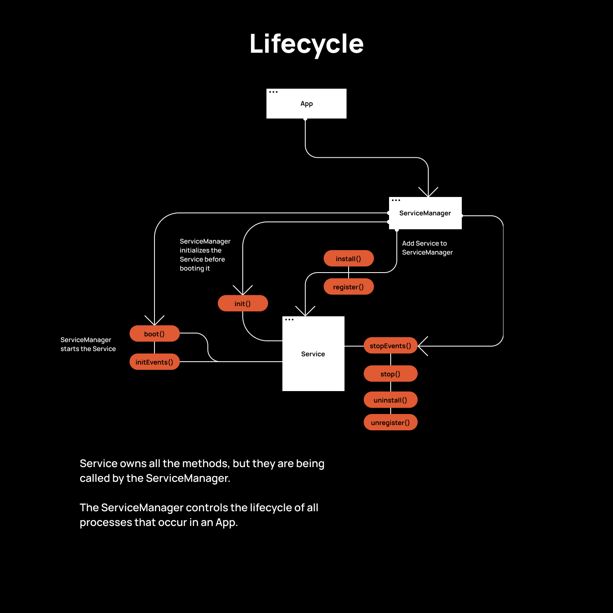

# @okikio/native

The framework that encourages performance, modern technologies, and great user experiences. The idea behind `@okikio/native` is that it acts as the core to the `native` initiative, it combines all the other package into it a core package that is ~7 KB (minified & compressed).

`@okikio/native` is a guideline on how to create great web experiences, that integrate into the system in use by the user and feel like a cohesive and native experience.

The idea behind it is that when an application feels native it integrates well into prior systems and `just works` and  works well. So, for example, a dark mode that follows the entire system. The `just works` is the key aspect of the framework, it should work without the user skipping a bit of whatever task they are aiming to complete.

On the web this boils down to being performant, efficient, and smooth.

The `@okikio/native` package acchieves performance, high efficiency, and a smooth experience by being heavily modern (relying on passive polyfills that only run on browsers that don't support certain features) and being well optimized.

Currently many websites rely on older code to make sure they reach as wide an audience as possible, hurting performance with large amounts of overhead.

`@okikio/native` uses modern browser api's like the Web Animation API, Maps, pushState, etc.... to achieve high efficiency and performance (as these API can be smartly managed by the browser). The browser API's can be difficult to work with, so, I developed `@okikio/manager`, `@okikio/emitter`, and `@okiko/animate` libraries to make them more managable. I developed these libraries to ensure the framework is well optimized and to avoid larges ammounts of npm dependencies.

You can play with `native` using Gitpod:

[](https://gitpod.io/#https://github.com/okikio/native)

## Table of Contents
- [@okikio/native](#okikionative)
  - [Table of Contents](#table-of-contents)
  - [Getting Started](#getting-started)
  - [Demo](#demo)
  - [API](#api)
    - [ManagerItem](#manageritem)
      - [MangerItem#manager: IAdvancedManager;](#mangeritemmanager-iadvancedmanager)
      - [MangerItem#app: IApp;](#mangeritemapp-iapp)
      - [MangerItem#config: ICONFIG;](#mangeritemconfig-iconfig)
      - [MangerItem#emitter: EventEmitter;](#mangeritememitter-eventemitter)
      - [MangerItem#key: any;](#mangeritemkey-any)
      - [MangerItem#install(): any;](#mangeriteminstall-any)
      - [MangerItem#register(manager: IAdvancedManager, key: any): ManagerItem;](#mangeritemregistermanager-iadvancedmanager-key-any-manageritem)
      - [MangerItem#uninstall(): any;](#mangeritemuninstall-any)
      - [MangerItem#unregister(manager: IAdvancedManager, key: any): any;](#mangeritemunregistermanager-iadvancedmanager-key-any-any)
    - [AdvanncedManager](#advanncedmanager)
      - [AdvancedManager#....Manager](#advancedmanagermanager)
      - [AdvancedManager#app: IApp;](#advancedmanagerapp-iapp)
      - [AdvancedManager#config: ICONFIG;](#advancedmanagerconfig-iconfig)
      - [AdvancedManager#emitter: EventEmitter;](#advancedmanageremitter-eventemitter)
      - [AdvancedManager#constructor(app: IApp): AdvancedManager<K, V extends ManagerItem>](#advancedmanagerconstructorapp-iapp-advancedmanagerk-v-extends-manageritem)
      - [AdvancedManager#set(key: K, value: V): AdvancedManager<K, V extends ManagerItem>](#advancedmanagersetkey-k-value-v-advancedmanagerk-v-extends-manageritem)
    - [Service](#service)

## Getting Started

`native` is a framework who's goal is to make it easier to create complex, performant, light-weight, web applications using native js apis. It was inspired by Rezo Zero's Starting Blocks project, and Barba.js. Both libraries had a major impact on the development of this project. Barba.js is easy to use and elevates the experience of a site with the use of PJAX, while Starting Blocks used native apis to create light-weight but complex web experiences. This project exists as a more flexible alternative to Starting Blocks, but with the same intuitive design and experience (UX/DX) Barba.js provides. It also, allows for web apps to be created without the need of PJAX, and safely switches back to normal HTML controls if JS is disabled.

This project is called a framework but it is more like a guideline, if all you want is a simple starter project that has PJAX built in then you install the project from `npm` once it becomes available, but otherwise you download the project into you workspace and tweak it to match your projects needs and remove all the extra fluff you don't want (By the way, this project works best with treeshaking, so, for the sake of speed, performance, and weight use Rollup or Webpack; Rollup is preferred).

This package is built for es2020, it expects the user to use a build tool support older versions of browsers, the idea being most people are using evergreen browsers, so, why are web developers piling on polyfill code that most users don't need.

## Demo

Located in [./build](./build), you will find multiple build files that can help you create your setup. The [pug folder](./build/pug) contains [pug](https://pugjs.org/api/getting-started.html) files that format my html in a clean and clear way. The [sass folder](./build/sass) contains [scss](https://sass-lang.com/guide) files that allow for modern css without the need of polyfills. The [ts folder](./build/ts) contains [typescript](https://www.typescriptlang.org/) files that the framework runs on; typescript is used, because Intellisense is better with typescript. Outside the build folder, the [gulpfile.js](./gulpfile.js) file, is part of my [gulp](https://gulpjs.com/) config, and is the tool I use to build the demo, for your project other tools should also work, with some amoount of work. Explore the files stated above to learn how to get started.


> [View the Demo  &#8594;](https://okikio.github.io/native/packages/native/demo/)


## API
`@okikio/native` has 5 base classes, they are:
* `ManagerItem`
* `AdvanncedManager`
* `Service`
* `ServiceManager`
* `App`

There are also 6 project based classes:
* `Router`
* `TransitionManager`
* `Page`
* `PageManager`
* `HistoryManager`
* `PJAX`

Project based classes are optional and are based on the type of project you are creating, if they are not used, tree shaking using `rollup`, or `esbuild`, should get rid of them.

The `5 base classes` are mandatory classes that are built into the framework,  tree shaking won't be able to get rid of them.

### ManagerItem

MangerItem is a class that can only be stored in the `AdvancedManager` class, it posses is self aware of it's envrioment, so things like the manager it's attached to, and the `App` instance that the `AdvancedManager` is attached to. It can also access data from other `ManagerItem`'s via the `AdvancedManager` and `App`. Be very careful with `ManagerItem` as it references, so, many other classes that if you don't properly dispose of a reference you might create a mermory leak unknowingly. When it comes to references it

`ManagerItem` only gains self awareness after it has been registered with a `AdvancedManager` that has also been instantiated in an `App` (rather non-dynamic isn't it). I didn't use Promises or other dependency injection methods, because it adds complexity and bulk in a way most project don't need. If your project rquires such a dynamic and complex setup you should use WebWorkers and a custom dependency injection setup, this is far out of the scope of this project, so, it will require a custom solution for each project. If in the future `@okikio/native` needs dependency injection I would be willing to build it in.

*Note: when working with WebWorkers don't use more than one or 2 at a time, I have found that two is the maximum that lower end hardware can safely use with max performance.*

#### MangerItem#manager: IAdvancedManager;
```ts
MangerItem.prototype.manager: IAdvancedManager;

/**
 * The AdvancedManager the ManagerItem is attached to;
 * It only gains self awareness after it has been registered to a `AdvancedManager` that has also been instantiated in an `App`
 *
 * @type IAdvancedManager
 */
```

#### MangerItem#app: IApp;
```ts
MangerItem.prototype.app: IApp;

/**
 * The App the ManagerItem is attached to
 *
 * @type IApp
 */
```

#### MangerItem#config: ICONFIG;
```ts
MangerItem.prototype.config: ICONFIG;

/**
 * The Config of the App the ManagerItem is attached to
 *
 * @type ICONFIG
 */
```

#### MangerItem#emitter: EventEmitter;
```ts
MangerItem.prototype.emitter: EventEmitter;

/**
 * The EventEmitter of the App the ManagerItem is attached to
 *
 * @type EventEmitter
 */
```


#### MangerItem#key: any;
```ts
MangerItem.prototype.key: any;

/**
 * The key of ManagerItem when set in a AdvancedManager;
 *
 * @type any
 */
```

#### MangerItem#install(): any;
```ts
MangerItem.prototype.install(): any;

/**
 * Runs after the ManagerItem has been registered. By default it does nothing, but if ManagerItem is extended it can be fairly useful for completing tasks right after it a ManagerItem is added to an AdvancedManager
 *
 * @returns any
 */
```

#### MangerItem#register(manager: IAdvancedManager, key: any): ManagerItem;
```ts
MangerItem.prototype.register(manager: IAdvancedManager, key: any): ManagerItem;

/**
 * Registers the ManagerItem and makes it self aware
 *
 * @param {IAdvancedManager} manager
 * @param {any} key
 * @returns ManagerItem
 */
```

#### MangerItem#uninstall(): any;
```ts
MangerItem.prototype.uninstall(): any;

/**
 * Runs before the ManagerItem has been unregistered. By default it does nothing, but if ManagerItem is extended it can be fairly useful, for disposing of references, etc...
 *
 * @returns any
 */
```

#### MangerItem#unregister(manager: IAdvancedManager, key: any): any;
```ts
MangerItem.prototype.unregister(): any;

/**
 * Unregisters the ManagerItem, removes its self awareness, and removes the ManagerItem from the AdvancedManager. Use this onces you are done with a ManagerItem and want to dispose of it's access to other base classes
 *
 * @returns any
 */
```

```ts
// Example:
import { App, AdvancedManager, ManagerItem } from "@okikio/native";

const app = new App();
const manager = new AdvancedManager(app);
const item = new ManagerItem(); // Not yet self aware
const item2 = new ManagerItem(); // Not yet self aware

// Now ManagerItem is self aware
manager.add(item);
manager.set("item2", item2);

// ManagerItem now has access to App, Config, Manager, Emitter, etc...
console.log(item.app); // => App { ... }
console.log(item.config); // => { ... }
console.log(item.emitter); // => EventEmitter { ... }
console.log(item.manager); // => AdvancedManager { ... }
console.log(item.manager.get("item2")); // => ManagerItem { ... }
console.log(item2.key); // => "item2"
console.log(item); // => ManagerItem { ... }

item2.unregister();

// ManagerItem now has access to App, Config, Manager, Emitter, etc...
console.log(item2.app); // => undefined
console.log(item2.config); // =>undefined
console.log(item2.emitter); // => undefined
console.log(item2.manager); // => undefined
console.log(item2); // => ManagerItem { ... }

// Note: it unregisters the key, and removes the ManagerItem from the AdvancedManager
console.log(item2.key); // => undefined
console.log(item.manager.get("item2")); // => undefined
```

*Note: `Service` extends `ManagerItem`, so, everything that holds for `ManagerItem` also holds for `Service`.*

### AdvanncedManager

The `AdvancedManager` class is an extention of the `Manager` class (as in `AdvancedManager` extends `Manager`). `AdvancedManager` has the ability to share details about the `App` class it's attached to, to the `ManagerItem`'s it stores.

For example, `AdvancedManager` can give access to the `App` classes `ServiceManager` to a `ManagerItem` from another `AdvancedManager`, allowing a `ManagerItem` to access `Service`'s running on the `App` inside `ServiceManager`.

```ts
// E.g.
import { AdvancedManager, ManagerItem, Service } from "../../src/api";
const app = new App();
const manager = new AdvancedManager(app);
const item = new ManagerItem(); // Not yet self aware
app.test_manager = manager;

// Now ManagerItem is self aware
manager.set("item", item);

// Not yet self aware; Service extends ManagerItem
const service = new Service();
app.set("service", service); // Now Service is self aware

console.log(item.app.get("service")); // => Service { ... }
console.log(service.app.test_manager); // => AdvancedManager { ... }

let _item = service.app.test_manager.get("item");
console.log(_item); // => ManagerItem { ... }
console.log(_item.key); // => "item"
console.log(item.key); // => "item"
```
#### AdvancedManager#....Manager#
All the properties and methods of the `Manager` class, read `@okikio/manager`'s README to learn more [../manager/README.md](../manager/README.md).

#### AdvancedManager#app: IApp;
```ts
AdvancedManager.prototype.app: IApp;

/**
 * The App the AdvancedManager is attached to
 *
 * @type IApp
 */
```

#### AdvancedManager#config: ICONFIG;
```ts
AdvancedManager.prototype.config: ICONFIG;

/**
 * The Config of the App the AdvancedManager is attached to
 *
 * @type ICONFIG
 */
```

#### AdvancedManager#emitter: EventEmitter;
```ts
AdvancedManager.prototype.emitter: EventEmitter;

/**
 * The EventEmitter of the App the AdvancedManager is attached to
 *
 * @type EventEmitter
 */
```

#### AdvancedManager#constructor(app: IApp): AdvancedManager<K, V extends ManagerItem>
```ts
AdvancedManager.prototype.constructor(app: IApp): AdvancedManager<K, V extends ManagerItem>;
new AdvancedManager(app: IApp): AdvancedManager<K, V extends ManagerItem>;

/**
 * @param {IApp} app - The instance of the App class, the Manager is instantiated in
 */
```

#### AdvancedManager#set(key: K, value: V): AdvancedManager<K, V extends ManagerItem>
```ts
AdvancedManager.prototype.set(key: K, value: V): AdvancedManager<V extends ManagerItem>;

/**
 * Set a value (V extends ManagerItem) in the Manager and register the ManagerItem
 *
 * @param  {K} key - The key where the ManagerItem will be stored
 * @param  {V extends ManagerItem} value - The ManagerItem to store
 * @returns AdvancedManager<K, V extends ManagerItem>
 */
```

The example above should also work to explain how to use the AdvancedManager API's.

*Note: `ServiceManager` extends `AdvancedManager`, so all the properties and methods present, will also work on `ServiceManager`.*


### Service
`Service` does everything, it is what enables, `PJAX`, `HistoryManager`, `Router`, `PageManager`, `Page`, and `TransitionManager` to function, even though they are seperate from the `App` class.

`Service` is an extention of `ManagerItem`, that adds extra life-cycle methods for controlling specific kinds of actions that require js.

The life-cycle methods of a `Service` are register, install, init, boot, initEvents, stop, stopEvents, uninstall, and unregister.

Here is a diagram that may help your understanding.
[](./assets/lifecycle.png)


	/**
	 * Method is run once when Service is installed on a ServiceManager
	 */
	public install(): void { }

	// Called before the start of a Service, represents a constructor of sorts
	public init(...args: any): any;
	public init(): any { }

	// Called on start of Service
	public boot(...args: any): any;
	public boot(): any {
		this.initEvents();
	}

	// Initialize events
	public initEvents(): void { }

	// Stop events
	public stopEvents(): void { }

	// Stop services
	public stop(): void {
		this.stopEvents();
		this.unregister();
	}
}
